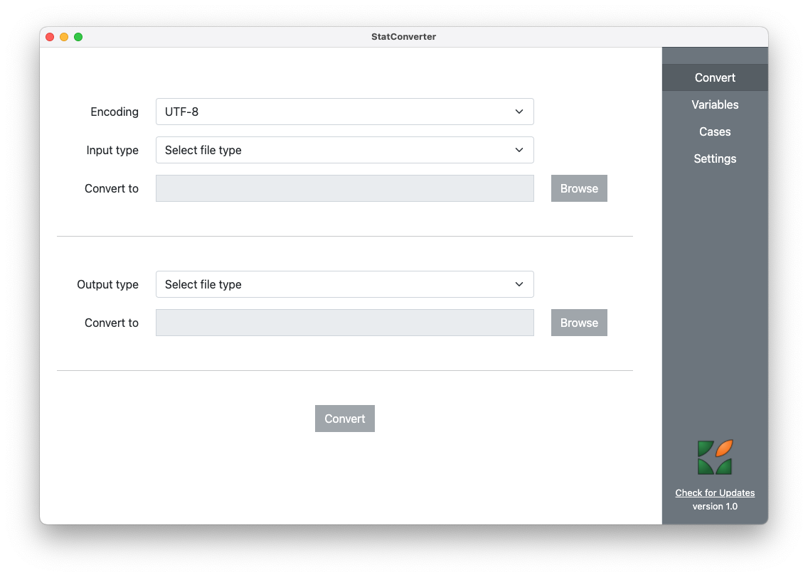

<!-- https://github.com/pages-themes/modernist -->

StatConverter is a tool to convert to and from various statistical software formats: R, SPSS, Stata, SAS (even Excel) and DDI Codebook.




It is a graphical user interface using Node.js and Electron, to build cross-platform desktop applications using HTML, CSS, and JavaScript, and the actual conversion is done using the **R** environment. This software is available in multiple ways, depending on the operating system. Apart from the sources that are present on GitHub, this page also offers platform specific binaries.

On Windows:

- install as a self-contained application with **R** embedded: <button type="button" style="background:#3E72AF;color:white;"><a href="https://github.com/RODA/Files/blob/main/StatConverter_Setup_1.0.0.exe?raw=true"><span style="color:white">Download installer</span></a></button>

- install as an application that relies on a separate, existing installation of **R** (installer to be added)

- executable application, no need to install, with **R** embedded (compressed file to be added)

- executable application, no need to install, requiring a separate installation of **R** (compressed file to be added)


There is no portable **R** on MacOS and Linux. On these platforms, StatConverter requires a local installation of **R** (link to [CRAN](https://cran.r-project.org/bin/) download page), much like RStudio sitting on top of **R**. Binaries for these platforms will be added here, too.


### Installing the necessary R packages

StatConverter uses a couple of **R** packages that need to be installed:

```r
install.packages(c("DDIwR", "jsonlite"), dependencies = TRUE)
```

It is important to have these packages with all their dependencies, otherwise functionality might be lost.

The actual package that does the heavy lifting is `DDIwR` (DDI with R), which uses the package `haven` which in turn uses Evan Miller's `ReadStat` C library.

### R needs to be found on the system PATH

On Unix systems (including MacOS), R is automatically added to the system PATH upon installation. On Windows, this has to be done manually:

- search for "Edit the system environment variabled" in Control Panel

- click the "Advanced" tab

- click on the "Environment Variables..." button

- double-click on the "Path" variable to open it

- click on "New", then "Browse" and indicate the folder where **R** is installed, typically in C:/Program Files/R/R-4.2.0/bin
(the actual version number depends on the moment when **R** is installed)

### Running StatConverter from sources

StatConverter can also be started from its source files.

The first step is to create a clone of the [GitHub](https://github.com/RODA/StatConverter) repository.

[Node.js](https://nodejs.org/download/release/v14.18.2/) needs to be installed, we recommend version 14 which we are using.

On Windows, users need to install the Microsoft Visual Studio Tools (we've installed the 2019 version, especially the C++ tools) and also [Git](https://git-scm.com/downloads), which needs to be on the system PATH as well.

Then open a Terminal in the clone of the StatConverter directory, and type:

```
npm install
```

After Node.js will install all the necessary modules, type:

```
npm start
```

to start the application from sources.
